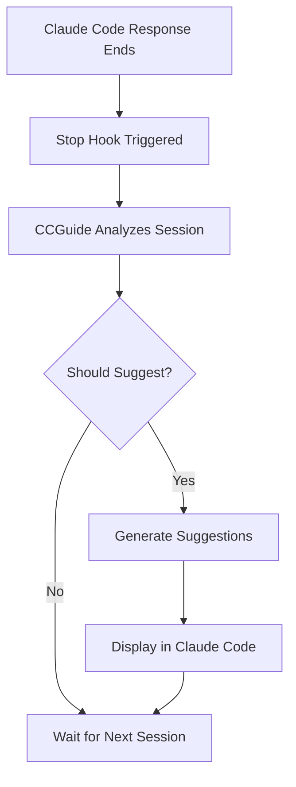

# 🧭 CCGuide - Claude Code AI Guide

[](https://github.com/ProCreations-Official/ccguide)
[](https://github.com/ProCreations-Official/ccguide)
[](https://python.org)

CCGuide is an intelligent AI-powered guidance system for Claude Code that provides automated suggestions and improvements using Google Gemini API.

## 🌟 Features

- **Intelligent Decision Making**: Uses Gemini 2.5 Flash-Lite to decide when suggestions are valuable
- **Contextual Suggestions**: Leverages Gemini 2.5 Flash for detailed, context-aware guidance
- **Hook Integration**: Seamlessly integrates with Claude Code's hook system
- **Language Detection**: Automatically detects programming languages and frameworks
- **Session Analysis**: Analyzes coding patterns and provides targeted suggestions
- **Cooldown Management**: Prevents suggestion spam with configurable cooldowns

## 🧰 CLI Commands

CCGuide includes a convenient CLI for easy management:

```bash
# Check current status
./ccguide status

# Enable CCGuide
./ccguide enable

# Disable CCGuide  
./ccguide disable

# Toggle on/off
./ccguide toggle

# Configure settings
./ccguide config --api-key YOUR_API_KEY
./ccguide config --cooldown 600  # 10 minutes
./ccguide config --min-length 200

# View recent logs
./ccguide logs -n 10

# Test functionality
./ccguide test

# Generate hooks config
./ccguide hooks
```

## 🚀 Quick Start

### 1. Installation

```bash
# Clone CCGuide from GitHub
git clone https://github.com/ProCreations-Official/ccguide.git
cd ccguide

# Run the setup script
python3 setup.py
```

### 2. Get Gemini API Key

1. Visit [Google AI Studio](https://aistudio.google.com/apikey)
2. Create or select a project
3. Generate an API key
4. Copy the API key for configuration

### 3. Configure CCGuide

Use the CLI to configure CCGuide:

```bash
# Set your API key
./ccguide config --api-key YOUR_API_KEY_HERE

# Check status
./ccguide status

# Test the setup
./ccguide test
```

Or edit `~/.ccguide/config.json` directly:

```json
{
  "gemini_api_key": "YOUR_API_KEY_HERE",
  "enable_suggestions": true,
  "suggestion_cooldown": 300
}
```

### 4. Setup Claude Code Hooks

Use the CLI to generate the hooks configuration:

```bash
# Generate hooks configuration
./ccguide hooks
```

Then copy the output to your Claude Code settings.

Example hooks configuration:
```json
{
  "hooks": {
    "Stop": [
      {
        "hooks": [
          {
            "type": "command",
            "command": "python3 /your/path/to/ccguide/stop_hook_handler.py",
            "env": {
              "PYTHONPATH": "/your/path/to/ccguide"
            }
          }
        ]
      }
    ]
  }
}
```
Or use the /hooks command, add a new Stop hook, and set the command to `python3 /your/path/to/ccguide/stop_hook_handler.py`
## 📋 How It Works



### Decision Process

CCGuide uses Gemini 2.5 Flash-Lite to intelligently decide when to provide suggestions based on:

- **Session Length**: Minimum activity threshold
- **Code Complexity**: Detection of significant coding work
- **Error Patterns**: Presence of bugs or issues
- **Best Practices**: Opportunities for improvement
- **Cooldown Period**: Prevents excessive suggestions

### Suggestion Categories

CCGuide provides suggestions in these areas:

1. **Code Quality** - Best practices, optimizations, refactoring
2. **Security** - Vulnerability detection, security enhancements
3. **Testing** - Test coverage gaps, testing strategies
4. **Documentation** - Missing docs, better comments
5. **Architecture** - Design patterns, structural improvements
6. **Performance** - Optimization opportunities
7. **Tooling** - Better development workflows

## ⚙️ Configuration

### Configuration File (`~/.ccguide/config.json`)

```json
{
  "gemini_api_key": "your-api-key",
  "decision_model": "gemini-2.5-flash-lite",
  "suggestion_model": "gemini-2.5-flash",
  "enable_suggestions": true,
  "min_session_length": 100,
  "suggestion_cooldown": 300,
  "log_level": "INFO"
}
```

### Configuration Options

| Option | Description | Default |
|--------|-------------|---------|
| `gemini_api_key` | Your Gemini API key | Required |
| `decision_model` | Model for decision making | `gemini-2.5-flash-lite` |
| `suggestion_model` | Model for suggestions | `gemini-2.5-flash` |
| `enable_suggestions` | Enable/disable system | `true` |
| `min_session_length` | Minimum chars before suggesting | `100` |
| `suggestion_cooldown` | Seconds between suggestions | `300` |
| `log_level` | Logging level | `INFO` |

## 🛠️ Advanced Usage

### Environment Variables

You can also use environment variables:

```bash
export GEMINI_API_KEY="your-api-key"
export CCGUIDE_LOG_LEVEL="DEBUG"
```

### Custom Prompts

Modify suggestion behavior in the config:

```json
{
  "custom_prompts": {
    "decision_factors": [
      "Code quality improvements needed",
      "Security considerations present"
    ],
    "exclusion_patterns": [
      "trivial file operations",
      "simple text edits"
    ]
  }
}
```

### Logging

CCGuide logs to `~/.ccguide/assistant.log`. Check logs for:
- Decision reasoning
- API errors
- Performance metrics

## 🔧 Troubleshooting

### CLI Troubleshooting

```bash
# Check if CCGuide is enabled
./ccguide status

# Enable if disabled
./ccguide enable

# View recent logs
./ccguide logs -n 20

# Test the system
./ccguide test
```

### Common Issues

**No suggestions appearing:**
- Run `./ccguide status` to check if enabled
- Check API key: `./ccguide status -v`
- Verify hooks are configured: `./ccguide hooks`
- Review logs: `./ccguide logs`

**API errors:**
- Verify Gemini API key: `./ccguide config --api-key YOUR_KEY`
- Check internet connection
- Review quota limits

**Temporary disable:**
```bash
# Quickly disable without changing hooks
./ccguide disable

# Re-enable when ready
./ccguide enable
```

### Debug Mode

Enable debug logging:

```bash
./ccguide config --log-level DEBUG
```

### Manual Testing

Test the system manually:

```bash
./ccguide test
# or
python3 src/stop_hook_handler.py test_session /path/to/transcript
```

## 📊 Session Analysis

CCGuide analyzes sessions for:

- **Languages Used**: Python, JavaScript, etc.
- **Frameworks**: React, Django, Express, etc.
- **Tools**: Git, Docker, AWS, etc.
- **Patterns**: API development, data analysis, etc.
- **Issues**: Security concerns, performance problems, etc.

## 🔒 Privacy & Security

- Session transcripts are sent to Gemini API for analysis
- No data is stored permanently by CCGuide
- API keys are stored locally in config files
- Review Google's data handling policies for Gemini API

## 📈 Performance

- **Decision Logic**: ~1-2 seconds with Flash-Lite
- **Suggestion Generation**: ~3-5 seconds with Flash
- **Memory Usage**: Minimal (< 50MB typically)
- **API Costs**: Optimized for cost-efficiency

## 🤝 Contributing

CCGuide is designed to be extensible:

1. **Custom Analyzers**: Add new session analysis methods
2. **Prompt Engineering**: Improve suggestion quality
3. **Integration**: Add support for other AI models
4. **Features**: Enhanced decision logic, new suggestion types

## 📁 Project Structure

```
ccguide/
├── 📂 src/                    # Core CCGuide modules
│   ├── stop_hook_handler.py   # Main hook handler
│   ├── gemini_decision_engine.py  # Decision logic
│   └── gemini_suggestion_engine.py # Suggestion generation
├── 📂 cli/                    # Command-line interface
│   ├── ccguide_cli.py         # CLI implementation
│   └── ccguide                # CLI wrapper script
├── 📂 tests/                  # Test files
│   └── test_*.py              # Various test modules
├── 🧰 ccguide                 # Main CLI entry point
├── ⚙️ setup.py                # Installation script
├── 📋 requirements.txt        # Dependencies
└── 📚 README.md               # Documentation
```

## 🆘 Support

For issues and questions:
1. Check the logs: `./ccguide logs`
2. Test the system: `./ccguide test`
3. Review this README and troubleshooting section
4. [Create an issue](https://github.com/ProCreations-Official/ccguide/issues) with relevant log excerpts

## 🤝 Contributing

We welcome contributions! Please see our [Contributing Guidelines](CONTRIBUTING.md) for details on:

- 🐛 **Bug Reports**: Use our issue templates
- 💡 **Feature Requests**: Share your ideas
- 🔧 **Pull Requests**: Follow our coding standards
- 📚 **Documentation**: Help improve our docs

### Quick Start for Contributors

```bash
# Fork and clone the repository
git clone https://github.com/your-username/ccguide.git
cd ccguide

# Set up development environment
python3 -m venv venv
source venv/bin/activate
pip install -r requirements.txt

# Make your changes and test
./ccguide test

# Submit a pull request
```

## 🔄 Updates

To update CCGuide:

```bash
# Pull latest changes
git pull origin main

# Update dependencies if needed
pip install -r requirements.txt

# Test the update
./ccguide test
```

## ⭐ Star History

If CCGuide helps you code better, please consider giving it a star on GitHub!

[](https://star-history.com/#ProCreations-Official/ccguide&Date)

---

<div align="center">

**🧭 Made with ❤️ for the Claude Code community**

[⭐ Star on GitHub](https://github.com/ProCreations-Official/ccguide) • 
[🐛 Report Bug](https://github.com/ProCreations-Official/ccguide/issues) • 
[💡 Request Feature](https://github.com/ProCreations-Official/ccguide/issues) • 
[📖 Documentation](https://github.com/ProCreations-Official/ccguide#readme)

</div>
